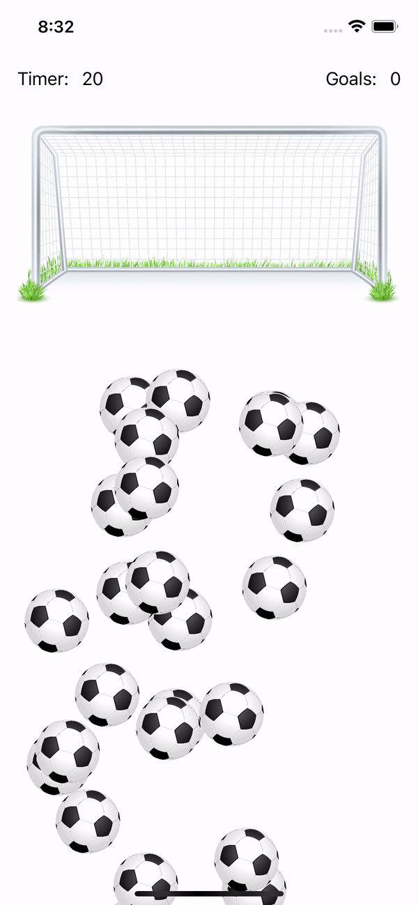

## ⌛️ Note:
<b>Please be aware that this project was created some time ago and does not reflect my current skill level. For a glimpse of my recent work and evolving abilities, I recommend exploring my more recent repositories, all of which are presented in <a href="https://oranlevi.dev" target="_blank" >my portfolio</a>.</b>

---

PlaySoccer
==========

PlaySoccer It is a game app, when balls are created on the screen and there is a time limit to insert them into the goal.

## Screenshots
  

    

